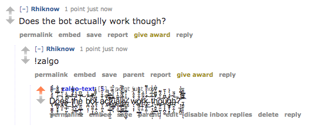

# zalgo-text-bot

# What is all this about?
First of all, what do I mean by "zalgo"?

You can go to a website such as https://www.zalgotextgenerator.com/ to convert text into a zalgo version

For ex:

Example of zalgo -> E&#859;&#785;&#833;&#787;&#848;&#785;&#772;&#794;&#853;&#801;&#839;&#798;&#798;&#825;&#791;&#809;&#813;x&#836;&#836;&#772;&#855;&#864;&#786;&#808;&#790;&#818;&#837;&#853;&#851;&#839;a&#775;&#781;&#795;&#768;&#782;&#779;&#776;&#771;&#819;&#811;&#818;&#791;&#840;&#791;m&#783;&#843;&#861;&#861;&#834;&#841;&#866;&#790;&#854;&#816;&#858;&#804;&#805;p&#769;&#830;&#855;&#786;&#843;&#836;&#849;&#772;&#812;&#845;&#790;&#798;&#799;&#801;l&#782;&#775;&#786;&#830;&#842;&#789;&#856;&#818;&#866;&#817;&#812;&#840;&#813;&#839;&#841;&#798;&#857;e&#864;&#771;&#780;&#783;&#831;&#836;&#861;&#768;&#774;&#806;&#815;&#796;&#854;&#809;&#814; o&#777;&#768;&#781;&#850;&#829;&#772;&#832;&#784;&#846;&#797;&#827;&#840;&#810;&#853;&#818;f&#834;&#835;&#864;&#836;&#771;&#825;&#837;&#825;&#827;&#801;&#825;&#808;&#866;&#810;&#824; z&#776;&#787;&#769;&#838;&#844;&#782;&#856;&#865;&#789;&#835;&#798;&#796;&#807;&#853;&#811;&#797;&#824;a&#859;&#848;&#844;&#785;&#779;&#771;&#774;&#835;&#836;&#826;&#804;&#816;&#805;&#863;&#828;l&#789;&#843;&#795;&#831;&#783;&#851;&#858;&#817;&#810;&#804;&#798;&#820;g&#795;&#775;&#849;&#781;&#776;&#831;&#801;&#800;&#808;&#806;&#798;&#801;&#816;&#823;o&#794;&#787;&#844;&#785;&#780;&#866;&#807;&#806;&#841;&#799;&#820;

## Why?

In reddit culture, there are often times when zalgo-ing a block of text serves as a humorous means.
The reddit bot serves to act as a quick and easy way to convert a block of text by merely replying
**!zalgo**
to a comment you want zalgo-fied.

### Example

## Okay... how does it work?

For this quick project, I wanted to use Python to increase my expertise with the language.
After stumbling around with the request library, I realised that since I'm using an external website to input the message and then get the output, I would need a persistant web instance. I couldn't just scrape some data from a website without interacting with it.

Here is where I found the Selenium Web Driver (https://selenium-python.readthedocs.io/) for python and used it to emulate keystrokes to input, click a button and retrieve the output via unicode.

## Conclusion

That's it for this reddit bot, as it's core functionality is very simple.
Now that I know about reddit bots, and Selenium (super cool), I'll be messing with it more in future projects!
